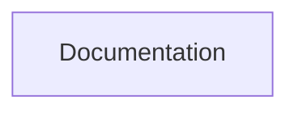

## Stack
- No manifest, source code, or entry points exist in this repository.
- Only file present at repo root: README.md.
- No language, framework, or library is observable — TODO: verify once code is added.

## Directory map
| path | what lives there |
|---|---|
| /README.md | Project description (one paragraph, no build/setup info) |
| /.git | Git metadata |

## Diagram

## Component index
- [[Documentation]] — the only artifact currently in the repository

## Entry points
- Dev entry point: TODO: verify (none exists yet)
- Prod entry point: TODO: verify (none exists yet)

## Conventions
- None observable — no code files exist to infer conventions from.

## Where things go
- To add the first implementation, create a manifest (e.g. package.json / pyproject.toml / go.mod / Cargo.toml) at repo root and re-run documentation.
- To describe the intended schema-parsing feature, expand README.md.
- To add an ER-diagram visualization component, create its source directory and update this ARCHITECTURE.md's diagram and component index accordingly.
